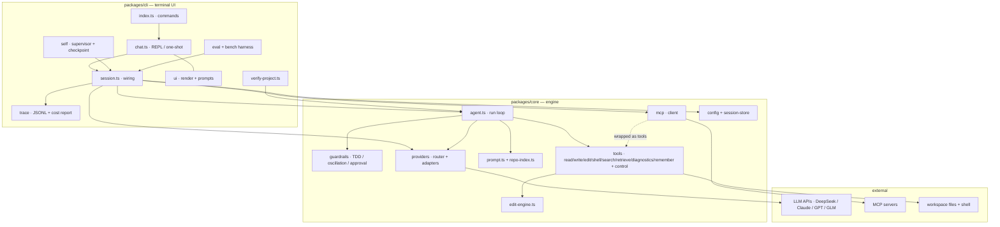
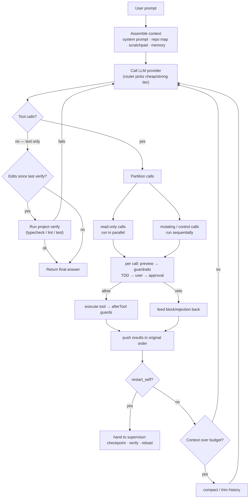

# scissor

A personal, Cursor-like terminal AI coding agent for Windows (and cross-platform). Chat with an LLM that can read, search, edit files and run commands in your current directory. No login, no plugin marketplace — just a fast local agent (with optional MCP tools).

Supports four providers out of the box: **DeepSeek**, **Claude (Anthropic)**, **OpenAI GPT**, and **GLM (Zhipu)**.

## Architecture

scissor is a small npm-workspaces monorepo with a strict **engine / UI split**, so
the core can later be reused by a GUI (e.g. Electron) without change:

- `packages/core` — UI-agnostic engine: provider abstraction + router, the agent
  loop, tools, guardrails, prompt/retrieval, edit engine, MCP client, config and
  session store. Zero terminal dependencies.
- `packages/cli` — terminal UI: command wiring, REPL / one-shot, rendering and
  approval prompts, session wiring, tracing + cost report, verification, the
  self-iteration supervisor, and the eval/benchmark harness.

### Components



### The agent loop

Everything composes around one loop in `agent.ts`. A single "turn" calls the
provider, runs any requested tools through the guardrail pipeline, feeds results
back, and repeats until the model produces a final answer (or a limit is hit):



### Key points

- **One loop, composable concerns.** The loop stays small; cross-cutting behavior
  is layered around it — tool policy via the **guardrail pipeline**
  (`[TDD?] → user guards → approval`), token/cost visibility via **tracing**,
  correctness via the **verification closed-loop**, and safe self-editing via the
  **supervisor**. None of them are tangled into the core control flow.
- **Engine is UI-agnostic.** `core` talks to the UI only through `AgentCallbacks`
  (text, tool start/end, approval, ask/plan, verify, compact, sub-agent), so a
  GUI can reuse it by implementing the same callbacks.
- **Provider abstraction + router.** Every model is an `LLMProvider`; a heuristic
  `RouterProvider` transparently routes each turn to a cheap or strong tier.
- **Tools are plain data + `run()`.** Control tools (`ask_user`, `present_plan`,
  `restart_self`, `update_scratchpad`, `spawn_subagent`) are intercepted in the
  loop; MCP tools are discovered at runtime and wrapped as native tools.
- **Session is the unit of memory.** Transcript + structured scratchpad, with
  automatic compaction/trim, persisted to `~/.scissor/sessions` for resume and
  restart continuity; durable facts live in `SCISSOR_MEMORY.md`.
- **Local-first, minimal deps.** No server, no database, no vector store — just
  files under `~/.scissor` and the workspace.

## Requirements

- Node.js >= 18 (LTS recommended)

## Install

```bash
npm install
npm run build
```

To run without building, use `npm run dev -- <args>` (executes via `tsx`).

### Make `scissor` available everywhere

The repo exposes a `scissor` bin. After building, link it onto your `PATH` once:

```bash
npm install
npm run build
npm link          # creates a global `scissor` command (Windows: scissor.cmd)
```

Now `scissor` works from any directory. To undo it later: `npm unlink -g scissor`.
If you don't want a global command, you can always run it in-repo via
`npm run scissor -- <args>` or `node packages/cli/dist/index.js <args>`.

> Note: `npm link` points the global command at this repo's build, so re-run
> `npm run build` after pulling changes. (The pre-push gate rebuilds for you.)

## Configure

Run the interactive wizard to store API keys in `~/.scissor/config.json`:

```bash
node packages/cli/dist/index.js config
# or during dev:
npm run dev -- config
```

Environment variables override stored keys: `DEEPSEEK_API_KEY`, `ANTHROPIC_API_KEY`, `OPENAI_API_KEY`, `GLM_API_KEY`, and `SCISSOR_PROVIDER`.

## Usage

Interactive REPL:

```bash
scissor
```

One-shot:

```bash
scissor "explain what this repo does"
```

Options:

- `-p, --provider <id>` — choose `deepseek | claude | gpt | glm`
- `--safe` — confirm every file change and command
- `--auto` — run everything automatically (only confirm dangerous actions)
- `--chat-only` — disable file edits and command execution
- `--no-verify` — disable the automated verification closed-loop
- `--router` — route each turn to a cheap/strong model tier by difficulty
- `--tdd` — enforce test-first coding (block source edits until a test exists)
- `--clarify` — lead clearly ambiguous requests with a clarifying question before planning
- `--trace` — write a structured JSONL trace of the session to `~/.scissor/traces`

REPL slash commands: `/help`, `/reset`, `/compact`, `/scratchpad`, `/remember <fact>`, `/info`, `/exit`.

## Codebase retrieval

At session start scissor builds a compact **repo map** (directory tree + top-level
symbols, respecting `.gitignore`) and injects it into the system prompt, so the
agent begins with an overview instead of blindly grepping. It also has a
`retrieve` tool: ranked keyword search across the workspace that returns the most
relevant files and matching lines for a natural-language query — better than a
single `grep` for "where is X handled" questions.

**Query rewriting.** When the user's wording is vague, abbreviated, or misspelled,
the model rewrites it: `retrieve` accepts a `queries` array of 2–4 normalized
phrasings (corrected spelling, likely identifier names, synonyms). Every file is
scored against each phrasing in one pass and the *best* match per file is kept, so
a file that matches any one phrasing still surfaces. This lifts recall for "where
is X" questions without an embedding index. (Language rewriting is the model's job;
merging/ranking is the tool's.)

## Intent clarification

Opt in with `--clarify` (or `"clarifyIntent": true` in `~/.scissor/config.json`,
or `SCISSOR_CLARIFY=1`). When enabled, if a request is clearly ambiguous or
underspecified — vague verbs like "improve it", no concrete target, or several
very different plausible readings — the agent's **first** action is a single
`ask_user` offering 2–3 concrete interpretations (plus an "other" path) before it
plans or edits. It treats likely typos charitably (surfacing its best reading as
an option) and asks at most one round; specific requests proceed without a gate.
This trades a quick question for far less wasted work on the wrong interpretation.

## Verification closed-loop

When the agent finishes a request in which it edited files, scissor automatically
runs the project's checks and, if they fail, feeds the output back so the agent
can self-correct (bounded by `maxVerifyAttempts`, default 2). Checks are detected
from `package.json` scripts (`typecheck`/`type-check`/`tsc`, then `lint`).

- Override the commands with `SCISSOR_VERIFY_COMMANDS="cmd1;cmd2"`.
- Disable per-run with `--no-verify`, or globally with `SCISSOR_NO_VERIFY=1`.

Beyond the automatic loop, the agent can also *ask* for semantic feedback on
demand via the **`diagnostics` tool** — a pragmatic slice of "LSP as a feedback
channel". It runs the project's type-checker/linter and returns structured
`file:line:col severity message` diagnostics, optionally filtered to a single
file — so the model fixes real type errors instead of guessing from `grep`. The
command is **auto-detected** from the project's own `typecheck`/`lint` npm
scripts or `tsc --noEmit` (an optional `checker: "typecheck" | "lint"` arg picks
one); the model **cannot** pass an arbitrary command, so `diagnostics` can't be
used as a side-channel around `run_shell`'s approval gate. Power users can point
it elsewhere with the `SCISSOR_DIAGNOSTICS_COMMAND` env var.

## Model router (token efficiency)

Enable with `--router` (or `router.enabled` in config). Each turn is scored for
difficulty and sent to a **cheap** tier by default, escalating to a **strong**
tier only when the turn looks hard — so you spend premium tokens only where they
matter. The routing is transparent (explainable signals, not a black-box model);
strong-tier turns log a one-line reason to stderr.

Signals (weights): a complex-intent keyword such as *refactor/debug/architecture/
优化/并发* (+3), a failed verification on the previous turn (+3), large context
(+2) or medium context (+1), and a long-running turn (+1). A turn escalates at a
total score of 3 (configurable).

Defaults with a single DeepSeek key: cheap `deepseek-chat`, strong
`deepseek-reasoner` — no extra API key required. Configure tiers in
`~/.scissor/config.json`:

```json
{
  "router": {
    "enabled": true,
    "cheap":  { "provider": "deepseek", "model": "deepseek-chat" },
    "strong": { "provider": "claude" },
    "threshold": 3,
    "escalateOnVerifyFail": true
  }
}
```

If the strong tier has no API key, the router degrades gracefully to the cheap
tier. Force-disable for one run with `SCISSOR_NO_ROUTER=1`. Validate that routing
doesn't hurt task success with `scissor eval --router`.

## Reliable edits

`edit_file` uses a tolerant matching engine so small mismatches don't waste a
turn:

- Line-ending (CRLF/LF) and trailing-whitespace differences are tolerated, as
  are stray leading/trailing blank lines — but a fuzzy match is only applied when
  it is unique, and unchanged lines keep their exact original formatting.
- `replace_all` replaces every occurrence; otherwise a match must be unique.
- Pass an `edits` array to make several changes to one file atomically.
- On a miss, the error points at the closest matching line so the retry is cheap.

## Memory model

scissor has both short-term and long-term memory, deliberately built from
**local, zero-dependency primitives** — no Redis, no vector database. Those are
scaling tools (Redis for sharing session state across many server processes; RAG
for retrieving from a corpus too large to fit in context), and a single-user
local agent has neither problem. The right-sized equivalents below do the same
job without the operational weight.

### Short-term (working) memory

The live conversation the model sees each turn, managed in three layers:

- **Transcript** — the full message history for the current session.
- **Structured scratchpad** — a small, agent-maintained snapshot of task state
  (goal, next step, last error, files in play, notes), updated via the
  `update_scratchpad` tool and **pinned into the system prompt**. Because it
  lives in the system message, it survives context compaction and restarts
  *verbatim* even when older messages are dropped — so the agent doesn't lose
  the thread on long tasks. View it with `/scratchpad`.
- **Compaction & trim** — when the conversation grows past a threshold, the
  oldest rounds are summarized into a rolling "summary of earlier conversation"
  note (via the LLM) instead of being discarded; a hard trim of oldest whole
  rounds is the fallback. The rolling summary and the scratchpad are both
  protected from trimming. Trigger compaction manually with `/compact`.

Short-term memory is persisted per session (transcript + scratchpad) to
`~/.scissor/sessions/<id>.json`, so `--resume` (and self-update restarts) carry
it over. List sessions with `scissor sessions`.

### Long-term (persistent) memory

- **`SCISSOR_MEMORY.md`** — durable facts (conventions, key commands, gotchas)
  the agent saves via the `remember` tool (or you, via `/remember <fact>`). If
  present in the workspace, it is injected into the system prompt at the start of
  every future session.
- **Session archive** — every past session (goal + transcript + scratchpad) is
  stored under `~/.scissor/sessions/` and can be resumed.
- **Codebase retrieval** — the repo map + `retrieve` tool act as memory *of the
  codebase* (see [Codebase retrieval](#codebase-retrieval)).

When these outgrow simple whole-file injection (a large memory file, or semantic
recall across many sessions), an **optional** embedding index is the planned next
step — see the memory backlog in `OPEN_ITEMS.md`. It stays optional precisely so
the lightweight default keeps working with no extra infrastructure.

## Sub-agents (delegation)

For large or noisy sub-tasks the agent can call `spawn_subagent` to delegate to a
**fresh child agent** with its own clean context but the same workspace and
file/search/shell tools. The child runs autonomously (it can't ask the user) and
only its concise **summary** returns to the parent — so the parent's context
stays focused instead of filling up with, say, a wide codebase investigation.

For several **independent** sub-tasks, `spawn_subagents` fans them out to child
agents that run **concurrently** and then fans in their summaries (map-reduce) —
e.g. auditing three modules at once. The parent only sees the aggregated result.

- Child edits happen in the same workspace, so they persist; the verification
  loop still runs after a delegation.
- Depth is guarded (`maxSubagentDepth`, default 1): a sub-agent cannot spawn
  further sub-agents, preventing runaway recursion.
- Parallel fan-out is capped (default 5) and is for **disjoint** tasks only —
  since children share the workspace, concurrent edits to the same files would
  race. Use `spawn_subagent` for dependent/sequential work.
- Sub-agent start/finish is shown inline in the REPL.

## Parallel tool execution

When a single turn requests several **read-only** tool calls (non-mutating tools
like `read_file`, `glob`, `grep`, `retrieve`), scissor runs them **concurrently**
instead of one at a time — e.g. reading five files or grepping several patterns
happens in one round trip's worth of wall time. Mutating tools (`write_file`,
`edit_file`, `run_shell`, ...) and control tools still run **sequentially in
order**, so approval prompts and side effects stay deterministic. Results are
always fed back in the original call order, keeping the transcript valid.

## Guardrails (tool hooks)

Every real tool call runs through one **guardrail pipeline** of unified
lifecycle hooks: a guard can veto a call before it runs (`beforeTool`) and
inspect or transform its result afterward (`afterTool`). A veto may carry a
custom result (or synthesize a generic "blocked" error) that is fed back to the
model so it changes course. This keeps *all* cross-cutting policy in one place
instead of scattered through the core loop — the built-in behaviors are all
guardrails:

- **TDD gate** (`createTddGuard`, active with `--tdd`) — blocks source edits
  until a test file has been touched this session.
- **Oscillation guard** (`createOscillationGuard`, on by default) — blocks the
  *exact same* tool call after it has failed a few times (default 3), breaking
  retry loops.
- **Approval gate** (`createApprovalGuard`, always last) — prompts for mutating
  calls per the approval policy; remembers "always", and a rejection is fed back
  as a non-error so the agent tries something else.

The effective order per call is `[TDD?] → [your guards] → approval`. Guards are
pluggable via the Agent's `guardrails` option, and each may implement `reset()`
to clear per-session state.

## Tracing (observability)

Run with `--trace` (or `SCISSOR_TRACE=1`) to append a structured **JSONL** trace
of the session to `~/.scissor/traces/<session-id>.jsonl` — one JSON object per
event: `session-start`, `turn`, `route` (which model tier was chosen and why),
`tool` (name, ok, duration ms), `usage` (tokens), `verify`, `compact`,
`subagent`, and `session-end`. It's off by default, best-effort (never breaks a
run), and useful for debugging behavior, measuring tool timings, and tuning the
router threshold / tracking token spend. Inspect it with any JSONL tool, e.g.:

```bash
scissor --trace "refactor the parser"
cat ~/.scissor/traces/*.jsonl | jq 'select(.type=="tool")'
```

### Token / cost report

`scissor trace [id|path]` aggregates a trace into a per-session **token and cost
report** — total and per-model token counts, an estimated USD cost (using an
approximate built-in price table; models without a price are counted but flagged
`n/a`), the cheap/strong routing split, and tool call/error/duration stats. With
no argument it uses the most recent trace.

```bash
scissor trace              # report on the latest traced session
scissor trace --list       # list available traces
scissor trace <id> --json  # machine-readable report
```

### trace → eval flywheel

Real sessions are the best source of regression tests. `scissor eval-gen` turns a
traced session into a **draft eval case**: it recovers the original prompt and the
files the agent produced, and scaffolds a check that asserts those artifacts
reappear. Review it, tighten the check (assert contents / run the program), and
move it into the eval or bench suite — so the eval signal grows from actual use.

```bash
scissor --trace "build a JSON<->CSV converter with tests"   # produces a trace
scissor eval-gen                    # draft from the latest trace -> evals/generated/
scissor eval-gen <id> --print       # print the draft to stdout instead
```

(The `json-csv-roundtrip` bench task was seeded exactly this way, then tightened
to check RFC-4180 quoting and a lossless round trip.)

## Self-iteration (experimental)

scissor can modify and reload its **own** source code under a supervisor that
keeps it safe:

```bash
scissor supervise "make your grep tool case-insensitive by default"
```

How it works:

- A stable **supervisor** process spawns the agent as a child.
- The agent edits scissor's source, then calls the `restart_self` tool.
- The supervisor **checkpoints** the change (git commit), **verifies** the new
  version (type-check + build + the **eval suite**, so a self-edit that breaks the
  agent's actual behavior is caught), and either reloads into it or **rolls back**
  to the last working version automatically. Set `SCISSOR_SKIP_EVAL=1` to gate on
  build only, or `SCISSOR_SELFUPDATE_EVAL_TASKS=id1,id2` to run a subset.
- The session (memory) is persisted across restarts, so the conversation
  continues seamlessly into the new version.
- The safety machinery (`packages/cli/src/self/**`, `scripts/**`) is protected and
  cannot be modified by the agent.

See [OPEN_ITEMS.md](OPEN_ITEMS.md) for the roadmap of larger improvements.

## Eval harness

A small suite of repeatable tasks (create a file, edit JSON, write & run a
script, rename a function, find a value in the code, fix a syntax error) runs the
agent in isolated temp workspaces and scores each result automatically — so you
can measure whether a prompt/tool change actually helps instead of guessing.

```bash
scissor eval                       # run all tasks on the default provider
scissor eval --list                # list tasks
scissor eval -t edit-json,fix-bug  # run specific tasks
scissor eval -p all --json evals/run.json   # every configured provider, save results
# or during dev:
npm run eval
```

Each task reports pass/fail with turns and timing, plus a per-provider pass rate.

## Benchmark & agent comparison

`scissor bench` runs a harder, more differentiating suite (scaffold a CLI, debug
a failing test, multi-file rename refactor, CSV data transform, dependency
version lookup in a larger tree) and — importantly — is **agent-agnostic**: the
exact same tasks and objective checks can score scissor *or any headless agent*,
so a head-to-head is apples-to-apples.

```bash
scissor bench                         # scissor, default provider
scissor bench --list                  # list benchmark tasks
scissor bench -p all --json evals/bench.json
npm run bench                         # dev shortcut
```

Compare against [goose](https://github.com/block/goose) (or any CLI agent):

```bash
# goose must be on PATH and have a provider configured (`goose configure`).
scissor bench --agent goose

# any other headless agent via a command template ({PROMPT} is substituted):
scissor bench --agent custom --agent-cmd "mytool run --quiet -t {PROMPT}"
```

The external adapter runs the agent once per task inside the prepared workspace
(`goose run --no-session --quiet -t <prompt>` with `GOOSE_MODE=auto`), then
scores the resulting files / final answer with the same checks. External-agent
runs are POSIX-oriented (mac/Linux/WSL); on native Windows, run goose under WSL.

Latest scissor baseline (DeepSeek `deepseek-chat`): **5/5 (100%)**.

## MCP servers (external tools)

scissor has a built-in [Model Context Protocol](https://modelcontextprotocol.io/)
client, so you can extend the agent with any MCP server (browser automation,
desktop control, databases, issue trackers, ...) without writing tool code. This
is how scissor gets a browser/screenshot capability like Cursor's, and desktop
control on Windows.

Servers are configured in `~/.scissor/mcp.json` (Cursor-compatible), managed via:

```bash
scissor mcp add browser     # preset: Playwright MCP (npx @playwright/mcp) - navigate, click, screenshot
scissor mcp add desktop     # preset: Terminator (npx terminator-mcp-agent) - operate/screenshot Windows apps
scissor mcp add my-db --command uvx --arg my-db-mcp   # any stdio server
scissor mcp add remote --url https://host/mcp         # remote Streamable HTTP server
scissor mcp list            # show configured servers
scissor mcp test [name]     # connect and list the tools a server exposes
scissor mcp disable <name>  # keep the entry but don't connect it
```

At session start, scissor connects the enabled servers and exposes their tools
to the agent as `mcp_<server>_<tool>`. Notes:

- **Approval**: MCP tools run through the approval gate by default (external
  tools can be destructive, e.g. desktop control). Allowlist specific tools with
  `--auto-approve <tool>` on `mcp add`.
- **Screenshots/images** returned by a tool are saved under
  `.scissor/mcp-images/` in the workspace and the path is handed back to the
  agent (works with every provider, including non-vision ones).
- **Disable per session** with `--no-mcp` or `SCISSOR_NO_MCP=1`. A failing
  server never breaks the session; it is skipped with a warning.
- External-agent (npx) servers are POSIX-friendly and also run on Windows; the
  `.cmd` shim is resolved automatically.

## Test-first (TDD) mode

Run with `--tdd` (or set `"tddMode": true` in `~/.scissor/config.json`) to force
a red-green-refactor workflow:

```bash
scissor --tdd "add a retry helper with backoff"
```

When on, the agent must create/edit a **test file** before it is allowed to
write or edit a **source-code file** (attempts to edit source first are rejected
with guidance). The verification loop also runs the project's `test` script, so
correctness is proven, not assumed. Non-code files (docs, config, data) are never
gated.

## Safety model

By default scissor uses a **plan-gate** flow: for non-trivial work it presents a numbered plan, waits for your approval, then executes the steps. Genuinely destructive commands are always confirmed. File operations are constrained to the current working directory.

## Development

```bash
npm install
npm run typecheck     # non-emitting type check
npm run build         # tsup build (also used by the self-update verification gate)
npm test              # deterministic tests (session, supervisor, retrieval, verify, edits, compaction, memory, eval, bench, mcp, tdd)
npm run smoke         # real-LLM tool-loop smoke (needs a provider key)
npm run smoke:plan    # real-LLM plan-gate smoke
npm run smoke:restart # real-LLM restart_self smoke
npm run smoke:verify  # real-LLM verification closed-loop smoke
npm run smoke:edit    # real-LLM CRLF edit smoke
npm run smoke:compact # real-LLM context-compaction smoke
npm run eval          # real-LLM eval suite (scored, per-provider)
npm run bench         # harder benchmark suite (scissor / goose / custom agent)
npm run check         # the full gate: typecheck + build + test + eval --strict
```

### Pre-push gate

A git `pre-push` hook runs the full pipeline automatically on every `git push`
so quality is enforced without anyone remembering to run it:

```
typecheck → build → tests → eval suite (real-LLM, --strict)
```

The hook is installed automatically by the `prepare` script on `npm install`
(it copies `.githooks/pre-push` into `.git/hooks/`; run `node scripts/install-hooks.mjs`
to (re)install manually). The eval step needs a configured provider key.

Bypass when necessary:

- `SCISSOR_SKIP_EVAL=1 git push` — skip only the eval suite (still runs typecheck/build/tests).
- `git push --no-verify` — skip the hook entirely (discouraged).

## License

Personal use.
