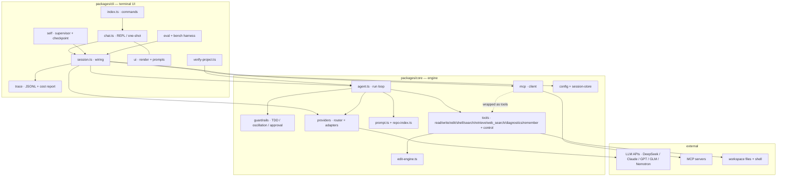
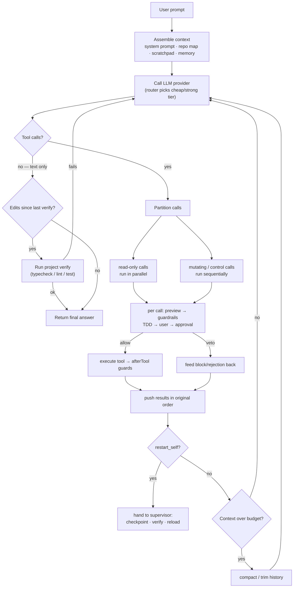

# scissor

A terminal AI coding agent. It reads, searches and edits files, runs commands,
verifies its own work, and asks before it does anything irreversible — in your
current directory, with no login and no server.

Supports five providers: **DeepSeek**, **Claude (Anthropic)**, **OpenAI GPT**,
**GLM (Zhipu)** and **Nebius Token Factory** (NVIDIA Nemotron open models).

## See it work (no API key)

```bash
git clone https://github.com/sayakawaii/scissor && cd scissor
npm install
npm run demo
```

Three commands, no key, no build, nothing to configure. `scissor demo` runs a
complete task end to end: a small project whose test fails, which the agent
locates, reproduces, fixes and re-runs.

**The model's replies are pre-scripted and no network request is made.**
Everything else is real — the same agent loop, plan gate, retrieval, edit engine,
guardrails and shell that a live session uses, against a real temporary
workspace. The test genuinely fails before the fix and genuinely passes after,
because `node` really runs it. The run is labelled a replay on screen, before
and after, so it cannot be mistaken for live inference.

```
→ retrieve  median calculation
→ read_file  src/stats.js
→ run_shell  node test/stats.test.js      ✗ Exit code: 1
→ edit_file  src/stats.js                 ✓ Edited src/stats.js: 1 replacement(s).
→ run_shell  node test/stats.test.js      ✓ Exit code: 0
```

## Run it for real

Add a provider key once, then give it a task. Any one of the five providers
works; DeepSeek and Nemotron Nano are the cheapest to try.

```bash
npm run build
npm link                      # optional: puts `scissor` on your PATH
scissor config                # store an API key in ~/.scissor/config.json
scissor "add a --json flag to the export command and a test for it"
```

Or without installing anything globally:

```bash
DEEPSEEK_API_KEY=... npm run dev -- "explain what this repo does"
```

`scissor` with no arguments opens an interactive REPL. Everything else —
sub-agents, MCP tools, the eval harness, the benchmark — is documented below.

## What it does

- **Agent loop with a plan gate** — presents a numbered plan for non-trivial
  work and waits for approval, then executes without re-asking per step.
- **Reliable edits** — a dedicated edit engine with CRLF/whitespace-tolerant
  matching and atomic multi-edit application, instead of whole-file rewrites.
- **Codebase retrieval** — a repo map in the prompt plus ranked keyword search
  with query rewriting, so it locates code instead of blind-grepping.
- **Web search** — [Tavily](https://tavily.com)-backed `web_search` for what the
  workspace cannot answer (unfamiliar libraries, current third-party APIs).
- **Verification closed-loop** — detects the project's own lint/typecheck/test
  commands, runs them after edits, and feeds failures back to itself.
- **Safety that fails closed** — an always-on write denylist, a shell command
  classifier that refuses rather than prompts, and optional Docker/WSL isolation.
- **Measurement** — an eval suite, a harder benchmark, an ablation matrix, and
  `scissor benchmark` for cross-model comparison with confidence intervals.

## Architecture

scissor is a small npm-workspaces monorepo with a strict **engine / UI split**, so
the core can later be reused by a GUI (e.g. Electron) without change:

- `packages/core` — UI-agnostic engine: provider abstraction + router, the agent
  loop, tools, guardrails, prompt/retrieval, edit engine, MCP client, config and
  session store. Zero terminal dependencies.
- `packages/cli` — terminal UI: command wiring, REPL / one-shot, rendering and
  approval prompts, session wiring, tracing + cost report, verification, the
  self-iteration supervisor, and the eval/benchmark harness.

### Components


```mermaid
flowchart TB
  subgraph CLI["packages/cli — terminal UI"]
    entry["index.ts · commands"]
    repl["chat.ts · REPL / one-shot"]
    sess["session.ts · wiring"]
    ui["ui · render + prompts"]
    trace["trace · JSONL + cost report"]
    vproj["verify-project.ts"]
    self["self · supervisor + checkpoint"]
    evalh["eval + bench harness"]
  end

  subgraph CORE["packages/core — engine"]
    agent["agent.ts · run loop"]
    guards["guardrails · TDD / oscillation / approval"]
    tools["tools · read/write/edit/shell/search/retrieve/web_search/diagnostics/remember + control"]
    edit["edit-engine.ts"]
    prompt["prompt.ts + repo-index.ts"]
    prov["providers · router + adapters"]
    mcp["mcp · client"]
    store["config + session-store"]
  end

  subgraph EXT["external"]
    llm["LLM APIs · DeepSeek / Claude / GPT / GLM / Nemotron"]
    mcps["MCP servers"]
    ws["workspace files + shell"]
  end

  entry --> repl --> sess
  sess --> agent
  sess --> prov
  sess --> mcp
  sess --> trace
  sess --> store
  repl --- ui
  vproj --> agent
  self --> sess
  evalh --> sess

  agent --> guards
  agent --> tools
  agent --> prompt
  agent --> prov
  tools --> edit
  tools --> ws
  mcp -. wrapped as tools .-> tools
  prov --> llm
  mcp --> mcps
```

### The agent loop

Everything composes around one loop in `agent.ts`. A single "turn" calls the
provider, runs any requested tools through the guardrail pipeline, feeds results
back, and repeats until the model produces a final answer (or a limit is hit):


```mermaid
flowchart TD
  U["User prompt"] --> P["Assemble context<br/>system prompt · repo map · scratchpad · memory"]
  P --> C["Call LLM provider<br/>(router picks cheap/strong tier)"]
  C --> D{"Tool calls?"}
  D -->|"no — text only"| V{"Edits since last verify?"}
  V -->|"yes"| VR["Run project verify<br/>(typecheck / lint / test)"]
  VR -->|"fails"| C
  VR -->|"ok"| Z["Return final answer"]
  V -->|"no"| Z

  D -->|"yes"| SPLIT["Partition calls"]
  SPLIT --> RO["read-only calls<br/>run in parallel"]
  SPLIT --> MU["mutating / control calls<br/>run sequentially"]
  RO --> HT["per call: preview → guardrails<br/>TDD → user → approval"]
  MU --> HT
  HT -->|"veto"| BK["feed block/rejection back"]
  HT -->|"allow"| EX["execute tool → afterTool guards"]
  EX --> PUSH["push results in original order"]
  BK --> PUSH
  PUSH --> RS{"restart_self?"}
  RS -->|"yes"| SUP["hand to supervisor:<br/>checkpoint · verify · reload"]
  RS -->|"no"| CB{"Context over budget?"}
  CB -->|"yes"| CO["compact / trim history"]
  CO --> C
  CB -->|"no"| C
```

### Key points

- **One loop, composable concerns.** The loop stays small; cross-cutting behavior
  is layered around it — tool policy via the **guardrail pipeline**
  (`[TDD?] → user guards → approval`), token/cost visibility via **tracing**,
  correctness via the **verification closed-loop**, and safe self-editing via the
  **supervisor**. None of them are tangled into the core control flow.
- **Engine is UI-agnostic.** `core` talks to the UI only through `AgentCallbacks`
  (text, tool start/end, approval, ask/plan, verify, compact, sub-agent), so a
  GUI can reuse it by implementing the same callbacks.
- **Provider abstraction + router.** Every model is an `LLMProvider`; a heuristic
  `RouterProvider` transparently routes each turn to a cheap or strong tier.
- **Tools are plain data + `run()`.** Control tools (`ask_user`, `present_plan`,
  `restart_self`, `update_scratchpad`, `spawn_subagent`) are intercepted in the
  loop; MCP tools are discovered at runtime and wrapped as native tools.
- **Session is the unit of memory.** Transcript + structured scratchpad, with
  automatic compaction/trim, persisted to `~/.scissor/sessions` for resume and
  restart continuity; durable facts live in `SCISSOR_MEMORY.md`.
- **Local-first, minimal deps.** No server, no database, no vector store — just
  files under `~/.scissor` and the workspace.

## Install (detail)

Node.js >= 18 (LTS recommended) is the only prerequisite. `npm install` is
enough to run `npm run demo` or `npm run dev -- <args>`, both of which execute
TypeScript directly via `tsx`; `npm run build` is needed only for the `scissor`
bin.

### Make `scissor` available everywhere

The repo exposes a `scissor` bin. After building, link it onto your `PATH` once:

```bash
npm run build
npm link          # creates a global `scissor` command (Windows: scissor.cmd)
```

Now `scissor` works from any directory. To undo it later: `npm unlink -g scissor`.
If you don't want a global command, you can always run it in-repo via
`npm run scissor -- <args>` or `node packages/cli/dist/index.js <args>`.

> Note: `npm link` points the global command at this repo's build, so re-run
> `npm run build` after pulling changes. (The pre-push gate rebuilds for you.)

## Configure

Run the interactive wizard to store API keys in `~/.scissor/config.json`:

```bash
node packages/cli/dist/index.js config
# or during dev:
npm run dev -- config
```

Environment variables override stored keys: `DEEPSEEK_API_KEY`, `ANTHROPIC_API_KEY`, `OPENAI_API_KEY`, `GLM_API_KEY`, `NEBIUS_API_KEY`, `TAVILY_API_KEY`, and `SCISSOR_PROVIDER`.

### Nebius Token Factory (NVIDIA Nemotron)

Token Factory serves NVIDIA's open Nemotron models behind an OpenAI-compatible
API, so it plugs into the same adapter as the other OpenAI-style providers. Set
`NEBIUS_API_KEY` (or add the key via `scissor config`) and pick the provider:

```bash
NEBIUS_API_KEY=... scissor -p nebius "explain what this repo does"
```

Defaults route the cheap tier to `nvidia/NVIDIA-Nemotron-3-Nano-30B-A3B` and the
strong tier to `nvidia/nemotron-3-super-120b-a12b`, so the router is a real
cheap/strong split on a single key. `nvidia/Nemotron-3-Ultra-550b-a55b` is
available as a per-session override (`--model`) or via config. Models are
region-pinned upstream; the global endpoint routes for you, but you can pin a
region by setting `providers.nebius.baseURL` to
`https://api.tokenfactory.us-central1.nebius.com/v1`.

## Usage

Interactive REPL:

```bash
scissor
```

One-shot:

```bash
scissor "explain what this repo does"
```

Replay demo (no API key, described at the top of this README):

```bash
scissor demo             # or `npm run demo` without building
scissor demo --keep      # keep the temporary workspace to inspect the diff
```

Options:

- `-p, --provider <id>` — choose `deepseek | claude | gpt | glm | nebius`
- `-m, --model <name>` — pin a specific model for this session
- `--safe` — confirm every file change and command
- `--auto` — run everything automatically (only confirm dangerous actions)
- `--chat-only` — disable file edits and command execution
- `--no-verify` — disable the automated verification closed-loop
- `--router` — route each turn to a cheap/strong model tier by difficulty
- `--tdd` — enforce test-first coding (block source edits until a test exists)
- `--clarify` — force intent-clarification on every request (default: auto-detect vague ones; `SCISSOR_NO_CLARIFY=1` to disable)
- `--trace` — session tracing is on by default; `SCISSOR_NO_TRACE=1` disables it, `SCISSOR_TRACE_KEEP=N` caps retention (default 50)

REPL slash commands: `/help`, `/reset`, `/compact`, `/scratchpad`, `/remember <fact>`, `/voice`, `/info`, `/exit`.

Voice mode (`/voice`) lets you talk to scissor: it transcribes your speech into
the prompt and can read replies aloud (e.g. scissor as a mock interviewer). The
default engine is local Windows speech (offline, no API key). See
[docs/voice.md](docs/voice.md).

## Codebase retrieval

At session start scissor builds a compact **repo map** (directory tree + top-level
symbols, respecting `.gitignore`) and injects it into the system prompt, so the
agent begins with an overview instead of blindly grepping. It also has a
`retrieve` tool: ranked keyword search across the workspace that returns the most
relevant files and matching lines for a natural-language query — better than a
single `grep` for "where is X handled" questions.

**Query rewriting.** When the user's wording is vague, abbreviated, or misspelled,
the model rewrites it: `retrieve` accepts a `queries` array of 2–4 normalized
phrasings (corrected spelling, likely identifier names, synonyms). Every file is
scored against each phrasing in one pass and the *best* match per file is kept, so
a file that matches any one phrasing still surfaces. This lifts recall for "where
is X" questions without an embedding index. (Language rewriting is the model's job;
merging/ranking is the tool's.)

## Web search

Repo retrieval only answers what the workspace already contains. An unfamiliar
library, the current signature of a third-party API, or an error string thrown by
a dependency are all dead ends for `retrieve`/`grep` — and a dead end is where a
model starts inventing APIs. The `web_search` tool closes that gap: it queries
[Tavily](https://tavily.com) and returns ranked results with summarized page
content, plus an optional one-paragraph answer.

Add a key via `scissor config` → *Configure web search (Tavily)*, or set
`TAVILY_API_KEY`:

```bash
TAVILY_API_KEY=tvly-... scissor "does undici support HTTP/2 yet?"
```

Details worth knowing:

- **Read-only**, so it parallelizes with other reads and never prompts for approval.
- **Optional.** With no key configured the tool reports a clear dead end ("web
  search is not configured") instead of failing the turn, and the prompt guidance
  that points the agent at it is only injected when the tool is present.
- **Sandbox-aware.** Under a `network: "none"` sandbox policy the call is refused
  rather than quietly reaching the internet.
- **No SDK.** It calls the Tavily HTTP API with the global `fetch`, which keeps
  the dependency count flat and — unlike the provider SDKs, see
  `packages/core/src/providers/proxy.ts` — honors `HTTPS_PROXY`.

## Intent clarification

When a request is clearly ambiguous or underspecified — vague verbs like
"improve it", no concrete target, or several very different plausible readings —
the agent's **first** action is a single `ask_user` offering 2–3 concrete
interpretations (plus an "other" path) before it plans or edits. It treats likely
typos charitably (surfacing its best reading as an option) and asks at most one
round. This trades a quick question for far less wasted work on the wrong path.

Three modes (default **auto**):

- **auto** (default) — a cheap, deterministic heuristic (`isVagueRequest`) checks
  each request; only *clearly vague* ones get the clarification nudge, injected
  into the system prompt for that turn only. Specific requests are never gated and
  pay zero cost. You don't manage a switch.
- **always** — `--clarify` (or `"clarifyIntent": true` in config, or
  `SCISSOR_CLARIFY=1`) bakes the guidance into every request; the model still
  self-judges whether a given request actually needs a question.
- **off** — `SCISSOR_NO_CLARIFY=1` disables it entirely.

The heuristic is precision-biased: it fires only when a vague marker is present
*and* no concrete target (file path, identifier, code fence, URL) is mentioned,
*and* the request is short — so it errs toward staying quiet.

## Verification closed-loop

When the agent finishes a request in which it edited files, scissor automatically
runs the project's checks and, if they fail, feeds the output back so the agent
can self-correct (bounded by `maxVerifyAttempts`, default 2). Checks are detected
from `package.json` scripts (`typecheck`/`type-check`/`tsc`, then `lint`).

- Override the commands with `SCISSOR_VERIFY_COMMANDS="cmd1;cmd2"`.
- Disable per-run with `--no-verify`, or globally with `SCISSOR_NO_VERIFY=1`.

Beyond the automatic loop, the agent can also *ask* for semantic feedback on
demand via the **`diagnostics` tool** — a pragmatic slice of "LSP as a feedback
channel". It runs the project's type-checker/linter and returns structured
`file:line:col severity message` diagnostics, optionally filtered to a single
file — so the model fixes real type errors instead of guessing from `grep`. The
command is **auto-detected** from the project's own `typecheck`/`lint` npm
scripts or `tsc --noEmit` (an optional `checker: "typecheck" | "lint"` arg picks
one); the model **cannot** pass an arbitrary command, so `diagnostics` can't be
used as a side-channel around `run_shell`'s approval gate. Power users can point
it elsewhere with the `SCISSOR_DIAGNOSTICS_COMMAND` env var.

## Model router (token efficiency)

Routing is **auto by default**: it turns on when it would actually help — i.e. the
strong tier has an API key and resolves to a *distinct* model from the cheap tier
(true out of the box for DeepSeek: `deepseek-chat` → `deepseek-reasoner`). If
there's no distinct/keyed strong tier (e.g. a lone GPT key), it stays off so
nothing changes. Force it on with `--router` (or `router.enabled` in config);
turn it off with `SCISSOR_NO_ROUTER=1`.

Each turn is scored for difficulty and sent to a **cheap** tier by default,
escalating to a **strong** tier only when the turn looks hard — so you spend
premium tokens only where they matter. The routing is transparent (explainable
signals, not a black-box model); strong-tier turns log a one-line reason to
stderr.

Signals (weights): a complex-intent keyword such as *refactor/debug/architecture/
优化/并发* (+3), a failed verification on the previous turn (+3), large context
(+2) or medium context (+1), and a long-running turn (+1). A turn escalates at a
total score of 3 (configurable).

Defaults with a single DeepSeek key: cheap `deepseek-chat`, strong
`deepseek-reasoner` — no extra API key required. Configure tiers in
`~/.scissor/config.json`:

```json
{
  "router": {
    "enabled": true,
    "cheap":  { "provider": "deepseek", "model": "deepseek-chat" },
    "strong": { "provider": "claude" },
    "threshold": 3,
    "escalateOnVerifyFail": true
  }
}
```

If the strong tier has no API key, the router degrades gracefully to the cheap
tier. Force-disable for one run with `SCISSOR_NO_ROUTER=1`. Validate that routing
doesn't hurt task success with `scissor eval --router`.

## Reliable edits

`edit_file` uses a tolerant matching engine so small mismatches don't waste a
turn:

- Line-ending (CRLF/LF) and trailing-whitespace differences are tolerated, as
  are stray leading/trailing blank lines — but a fuzzy match is only applied when
  it is unique, and unchanged lines keep their exact original formatting.
- `replace_all` replaces every occurrence; otherwise a match must be unique.
- Pass an `edits` array to make several changes to one file atomically.
- On a miss, the error points at the closest matching line so the retry is cheap.

## Memory model

scissor has both short-term and long-term memory, deliberately built from
**local, zero-dependency primitives** — no Redis, no vector database. Those are
scaling tools (Redis for sharing session state across many server processes; RAG
for retrieving from a corpus too large to fit in context), and a single-user
local agent has neither problem. The right-sized equivalents below do the same
job without the operational weight.

### Short-term (working) memory

The live conversation the model sees each turn, managed in three layers:

- **Transcript** — the full message history for the current session.
- **Structured scratchpad** — a small, agent-maintained snapshot of task state
  (goal, next step, last error, files in play, notes), updated via the
  `update_scratchpad` tool and **pinned into the system prompt**. Because it
  lives in the system message, it survives context compaction and restarts
  *verbatim* even when older messages are dropped — so the agent doesn't lose
  the thread on long tasks. View it with `/scratchpad`.
- **Task list** — a structured checklist (`todo_write`) of
  `pending` / `in_progress` / `completed` / `cancelled` items, patched by id
  (`merge: true`) or replaced wholesale, with at most one item in progress.
  Like the scratchpad it is pinned into the system prompt, so a multi-step plan
  survives compaction. The agent is nudged if the list goes stale or nothing is
  in progress.
- **Compaction & trim** — when the conversation grows past a threshold, the
  oldest rounds are summarized into a rolling "summary of earlier conversation"
  note (via the LLM) instead of being discarded. The fallback is **max-min
  fair-share truncation**: the remaining budget is divided fairly across
  messages, so one giant old tool result is shrunk to its share instead of
  costing an entire exchange. Messages whose share falls below a usefulness floor
  become `[omitted <role> message, N chars]` placeholders and the prompt carries a
  count of what was dropped. The rolling summary and the scratchpad are both
  protected from trimming. Trigger compaction manually with `/compact`.

Budgets are expressed in **tokens**, estimated through a single seam with a
per-provider chars-per-token ratio, so a real tokenizer can drop in later without
touching the loop.

Short-term memory is persisted per session (transcript + scratchpad + task list)
to `~/.scissor/sessions/<id>.json`, so `--resume` (and self-update restarts) carry
it over. List sessions with `scissor sessions`.

### System reminders

Rather than injecting extra messages (which costs a round trip and complicates
the transcript), situational nudges are appended onto the **last tool result**.
Per-turn counters drive them: N consecutive failures on one tool suggests trying
a different approach; a task list with nothing in progress, or untouched for many
calls, gets flagged; edits without a verification run get flagged. This
complements the oscillation guard, which only blocks *byte-identical* repeats.

### Long-term (persistent) memory

- **`SCISSOR_MEMORY.md`** — durable facts (conventions, key commands, gotchas)
  the agent saves via the `remember` tool (or you, via `/remember <fact>`). If
  present in the workspace, it is injected into the system prompt at the start of
  every future session.
- **Session archive** — every past session (goal + transcript + scratchpad) is
  stored under `~/.scissor/sessions/` and can be resumed.
- **Codebase retrieval** — the repo map + `retrieve` tool act as memory *of the
  codebase* (see [Codebase retrieval](#codebase-retrieval)).

When these outgrow simple whole-file injection (a large memory file, or semantic
recall across many sessions), an **optional** embedding index is the planned next
step — see the memory backlog in `OPEN_ITEMS.md`. It stays optional precisely so
the lightweight default keeps working with no extra infrastructure.

## Sub-agents (delegation)

For large or noisy sub-tasks the agent can call `spawn_subagent` to delegate to a
**fresh child agent** with its own clean context but the same workspace and
file/search/shell tools. The child runs autonomously (it can't ask the user) and
only its concise **summary** returns to the parent — so the parent's context
stays focused instead of filling up with, say, a wide codebase investigation.

For several **independent** sub-tasks, `spawn_subagents` fans them out to child
agents that run **concurrently** and then fans in their summaries (map-reduce) —
e.g. auditing three modules at once. The parent only sees the aggregated result.

- Child edits happen in the same workspace, so they persist; the verification
  loop still runs after a delegation.
- Depth is guarded (`maxSubagentDepth`, default 1): a sub-agent cannot spawn
  further sub-agents, preventing runaway recursion.
- Parallel fan-out is capped (default 5) and is for **disjoint** tasks only —
  since children share the workspace, concurrent edits to the same files would
  race. Use `spawn_subagent` for dependent/sequential work.
- Sub-agent start/finish is shown inline in the REPL.

## Long-running commands (background shells)

`run_shell` **starts** a command and tracks it rather than being strictly
synchronous, so scissor can run a dev server, drive a watcher, or sit through a
slow build:

- `block_until_ms` (default 30000) — how long to wait inline. If the command is
  still running at the deadline it **keeps running** and the agent gets a shell
  id, the output-file path, and everything captured so far.
- `is_background` / `block_until_ms: 0` — background it immediately.
- `await_shell { shell_id?, block_until_ms, pattern? }` — poll a shell, where
  `pattern` is a regex matched against its output. The agent blocks on
  `"listening on"` rather than guessing at sleeps. With no `shell_id` it is a
  plain sleep. Marked read-only, so it parallelizes and skips approval.

Every shell mirrors its full output to `.scissor/terminals/<id>.txt` with a live
header (`pid`, `cwd`, `command`, `isolation`, `running_for_ms`) and, on exit, a
footer (`exit_code`, `elapsed_ms`). So the inline text can be truncated without
losing anything. Background shells are killed when scissor exits.

Timeouts are **tiered** per tool (5m / 15m / 30m / 1h) rather than one flat cap,
derived from the tool and its `block_until_ms`; sub-agents get the long tier. A
timeout comes back with what to do next ("re-run with `block_until_ms: 0` to
background it, then poll"), not a bare failure.

Oversized results from *any* tool — including MCP ones — spill to
`.scissor/tool-output/<callId>.txt` via a guardrail, and the agent receives the
head, the tail, the path, and an explicit "the remainder was discarded; do not
retry expecting the full output" notice.

## Parallel tool execution

When a single turn requests several **read-only** tool calls (non-mutating tools
like `read_file`, `glob`, `grep`, `retrieve`), scissor runs them **concurrently**
instead of one at a time — e.g. reading five files or grepping several patterns
happens in one round trip's worth of wall time. Mutating tools (`write_file`,
`edit_file`, `run_shell`, ...) and control tools still run **sequentially in
order**, so approval prompts and side effects stay deterministic. Results are
always fed back in the original call order, keeping the transcript valid.

## Guardrails (tool hooks)

Every real tool call runs through one **guardrail pipeline** of unified
lifecycle hooks: a guard can veto a call before it runs (`beforeTool`) and
inspect or transform its result afterward (`afterTool`). A veto may carry a
custom result (or synthesize a generic "blocked" error) that is fed back to the
model so it changes course. This keeps *all* cross-cutting policy in one place
instead of scattered through the core loop — the built-in behaviors are all
guardrails:

- **TDD gate** (`createTddGuard`, active with `--tdd`) — blocks source edits
  until a test file has been touched this session.
- **Oscillation guard** (`createOscillationGuard`, on by default) — blocks the
  *exact same* tool call after it has failed a few times (default 3), breaking
  retry loops.
- **Approval gate** (`createApprovalGuard`, always last) — prompts for mutating
  calls per the approval policy; remembers "always", and a rejection is fed back
  as a non-error so the agent tries something else.

The effective order per call is `[TDD?] → [your guards] → approval`. Guards are
pluggable via the Agent's `guardrails` option, and each may implement `reset()`
to clear per-session state.

## Tracing (observability)

Every session appends a structured **JSONL** trace to
`~/.scissor/traces/<session-id>.jsonl` — one JSON object per event:
`session-start`, `turn`, `route` (which model tier was chosen and why), `tool`
(name, ok, duration ms), `usage` (tokens), `verify`, `compact`, `subagent`, and
`session-end`. Tracing is **on by default** (it costs only disk and feeds the
trace → eval flywheel), best-effort (never breaks a run), and self-limiting: only
the newest `SCISSOR_TRACE_KEEP` traces are kept (default 50). Disable per-run with
`SCISSOR_NO_TRACE=1`. It's useful for debugging behavior, measuring tool timings,
and tuning the router threshold / tracking token spend. Inspect it with any JSONL
tool, e.g.:

```bash
scissor --trace "refactor the parser"
cat ~/.scissor/traces/*.jsonl | jq 'select(.type=="tool")'
```

### Token / cost report

`scissor trace [id|path]` aggregates a trace into a per-session **token and cost
report** — total and per-model token counts, an estimated USD cost (using an
approximate built-in price table; models without a price are counted but flagged
`n/a`), the cheap/strong routing split, and tool call/error/duration stats. With
no argument it uses the most recent trace.

```bash
scissor trace              # report on the latest traced session
scissor trace --list       # list available traces
scissor trace <id> --json  # machine-readable report
```

### trace → eval flywheel

Real sessions are the best source of regression tests. `scissor eval-gen` turns a
traced session into a **draft eval case**: it recovers the original prompt and the
files the agent produced, and scaffolds a check that asserts those artifacts
reappear. Review it, tighten the check (assert contents / run the program), and
move it into the eval or bench suite — so the eval signal grows from actual use.

```bash
scissor --trace "build a JSON<->CSV converter with tests"   # produces a trace
scissor eval-gen                    # draft from the latest trace -> evals/generated/
scissor eval-gen <id> --print       # print the draft to stdout instead
```

(The `json-csv-roundtrip` bench task was seeded exactly this way, then tightened
to check RFC-4180 quoting and a lossless round trip.)

## Experience layer (learning from traces)

An OaK-inspired layer that turns first-person execution traces into structured
experience the agent can *learn from* — reliability of each tool per situation,
what actually contributes to finishing a task, and which capabilities to keep or
retire. It is **strictly staged for safety**: every stage is off by default and
each one only *observes* until you promote it with evidence. Nothing here changes
a permission or hard constraint. (Design: `docs/agent-design/oak-inspired-agent-design.md`.)

Normalized traces map into `(state, option, outcome)` events. `state` is a
low-cardinality, secret-free snapshot of the workspace (language, package manager,
VCS, size bucket, approval policy, TDD); `option` is a tool/skill plus its model
version; `outcome` is a termination class (`success | failure | cancelled |
budget | guardrail`), plus timing, cost, a normalized error signature, and the
**final task outcome** so an option is judged by whether it helped finish the job
— never by call count.

### Offline option-utility report (observe-only)

`scissor experience` aggregates every trace in `~/.scissor/traces` into per
`(state, option)` statistics: success rate with a Wilson confidence interval and
a sample-size gate, EWMA duration/cost, top error signatures, and
state-conditioned findings (options that are markedly more reliable in a given
state). It changes nothing about how the agent runs.

```bash
scissor experience                 # aggregate all traces
scissor experience <id>            # scope to one session
scissor experience --min-samples 8 # raise the confidence gate
scissor experience --json          # machine-readable
```

### Advisory mode (Phase 3, off by default)

`SCISSOR_EXPERIENCE_ADVICE=1` injects a compact, **advisory** block into the
system prompt for the current workspace state — ranked, confident options with
reasons and cautions, explicitly framed as *guidance, not rules*. The existing
policy still makes every decision; it safe-degrades to nothing when there's no
confident data. Preview what it would inject:

```bash
scissor experience --advise
```

### Restricted auto-routing (Phase 4, off by default)

A guardrail that can *steer* an unreliable tool call toward a more reliable
alternative — under strict controls: explicit `from>to` rules, a confidence gate,
a required reliability gap, a kill switch, and graceful fallback. It has three
modes via `SCISSOR_EXPERIENCE_ROUTE`:

- `shadow` — records what it *would* route (into the trace) without changing
  behavior, so you can measure it first;
- `enforce` — actually deflects the call with a non-error steering message the
  agent can act on or override;
- unset/`off` — disabled.

```bash
SCISSOR_EXPERIENCE_ROUTE=shadow \
SCISSOR_EXPERIENCE_ROUTE_RULES="grep>retrieve" \
SCISSOR_EXPERIENCE_ROUTE_KILL="write_file" \
  scissor "find where retries are configured"
```

### Capability curation (Phase 5, suggestions only)

`scissor experience --curate` reviews the report and suggests, per confident
cell, one of `disable` / `investigate` / `archive` / `demote` / `promote` /
`keep` — with a reason grounded in reliability and final-task contribution.
**Nothing is applied automatically**; it's a maintenance view for you to act on,
and permissions/hard constraints are never touched.

```bash
scissor experience --curate         # ranked, most-actionable first
scissor experience --curate --json
```

### A/B eval harness (measure before promoting)

Before promoting advice or routing from shadow to enforce, prove it helps.
`scissor ab` runs the eval suite twice — a baseline with the experience layer off
and a candidate with the chosen policy on — and reports fixed/broken tasks plus
pass and turns deltas. Under `--strict` any newly broken task fails the command.

```bash
scissor ab                                  # baseline vs advice-on (default)
scissor ab --candidate route --strict       # baseline vs route-enforce, fail on regressions
scissor ab -t create-file,fix-bug           # scope to specific tasks
```

## Self-iteration (experimental)

scissor can modify and reload its **own** source code under a supervisor that
keeps it safe:

```bash
scissor supervise "make your grep tool case-insensitive by default"
```

How it works:

- A stable **supervisor** process spawns the agent as a child.
- The agent edits scissor's source, then calls the `restart_self` tool.
- The supervisor **checkpoints** the change (git commit), **verifies** the new
  version (type-check + build + the **eval suite**, so a self-edit that breaks the
  agent's actual behavior is caught), and either reloads into it or **rolls back**
  to the last working version automatically. Set `SCISSOR_SKIP_EVAL=1` to gate on
  build only, or `SCISSOR_SELFUPDATE_EVAL_TASKS=id1,id2` to run a subset.
- The session (memory) is persisted across restarts, so the conversation
  continues seamlessly into the new version.
- The safety machinery (`packages/cli/src/self/**`, `scripts/**`) is protected and
  cannot be modified by the agent.

See [OPEN_ITEMS.md](OPEN_ITEMS.md) for the roadmap of larger improvements.

## Eval harness

A small suite of repeatable tasks (create a file, edit JSON, write & run a
script, rename a function, find a value in the code, fix a syntax error) runs the
agent in isolated temp workspaces and scores each result automatically — so you
can measure whether a prompt/tool change actually helps instead of guessing.

```bash
scissor eval                       # run all tasks on the default provider
scissor eval --list                # list tasks
scissor eval -t edit-json,fix-bug  # run specific tasks
scissor eval -p all --json evals/run.json   # every configured provider, save results
# or during dev:
npm run eval
```

Each task reports pass/fail with turns and timing, plus a per-provider pass rate.

## Benchmark & agent comparison

`scissor bench` runs a harder, more differentiating suite (scaffold a CLI, debug
a failing test, multi-file rename refactor, CSV data transform, dependency
version lookup in a larger tree) and — importantly — is **agent-agnostic**: the
exact same tasks and objective checks can score scissor *or any headless agent*,
so a head-to-head is apples-to-apples.

```bash
scissor bench                         # scissor, default provider
scissor bench --list                  # list benchmark tasks
scissor bench -p all --json evals/bench.json
npm run bench                         # dev shortcut
```

Compare against [goose](https://github.com/block/goose) (or any CLI agent):

```bash
# goose must be on PATH and have a provider configured (`goose configure`).
scissor bench --agent goose

# any other headless agent via a command template ({PROMPT} is substituted):
scissor bench --agent custom --agent-cmd "mytool run --quiet -t {PROMPT}"
```

The external adapter runs the agent once per task inside the prepared workspace
(`goose run --no-session --quiet -t <prompt>` with `GOOSE_MODE=auto`), then
scores the resulting files / final answer with the same checks. External-agent
runs are POSIX-oriented (mac/Linux/WSL); on native Windows, run goose under WSL.

Latest scissor baseline (DeepSeek `deepseek-chat`): **5/5 (100%)**.

### Provider comparison (`scissor benchmark`)

`bench` answers "did this agent pass?". `benchmark` answers the harder question:
**which model should I run this agent on, and what does each one cost me?** It
runs a fixed task set across several provider/model arms, repeats each arm N
times so the variance is visible, and writes both a JSON artifact and a
Markdown report to `benchmarks/` (committed, unlike the gitignored `evals/`
scratch).

```bash
# See the plan and the exact number of provider calls. Spends nothing.
scissor benchmark --arm nebius,deepseek --tasks eval --runs 5 --dry-run

# Compare two models on one provider by pinning each as its own arm.
scissor benchmark \
  --arm "nano=nebius:nvidia/NVIDIA-Nemotron-3-Nano-30B-A3B,super=nebius:nvidia/nemotron-3-super-120b-a12b" \
  --tasks eval --runs 5
```

Per arm the report carries pass rate with a 95% Wilson confidence interval,
tokens/task, cost/task, turns/task, files/task and ACRR, plus the
cost-normalized view — cost per passing task and passes per dollar — because
pass rate on its own just rewards the most expensive model.

One arm is one model: the router is off and the experience layer is disabled, so
the harness is fixed and only the model varies. The report declares a leader
**significant only when the two 95% intervals are disjoint**, and prints
"NOT statistically significant" otherwise rather than implying a winner the
sample size cannot support. See [`benchmarks/README.md`](benchmarks/README.md)
for the methodology and its limitations.

## MCP servers (external tools)

scissor has a built-in [Model Context Protocol](https://modelcontextprotocol.io/)
client, so you can extend the agent with any MCP server (browser automation,
desktop control, databases, issue trackers, ...) without writing tool code. This
is how scissor gets a browser/screenshot capability like Cursor's, and desktop
control on Windows.

Servers are configured in `~/.scissor/mcp.json` (Cursor-compatible), managed via:

```bash
scissor mcp add browser     # preset: Playwright MCP (npx @playwright/mcp) - navigate, click, screenshot
scissor mcp add desktop     # preset: Terminator (npx terminator-mcp-agent) - operate/screenshot Windows apps
scissor mcp add my-db --command uvx --arg my-db-mcp   # any stdio server
scissor mcp add remote --url https://host/mcp         # remote Streamable HTTP server
scissor mcp list            # show configured servers
scissor mcp test [name]     # connect and list the tools a server exposes
scissor mcp disable <name>  # keep the entry but don't connect it
```

At session start, scissor connects the enabled servers and exposes their tools
to the agent as `mcp_<server>_<tool>`. Notes:

- **Approval**: MCP tools run through the approval gate by default (external
  tools can be destructive, e.g. desktop control). Allowlist specific tools with
  `--auto-approve <tool>` on `mcp add`.
- **Screenshots/images** returned by a tool are saved under
  `.scissor/mcp-images/` in the workspace and the path is handed back to the
  agent (works with every provider, including non-vision ones).
- **Disable per session** with `--no-mcp` or `SCISSOR_NO_MCP=1`. A failing
  server never breaks the session; it is skipped with a warning.
- External-agent (npx) servers are POSIX-friendly and also run on Windows; the
  `.cmd` shim is resolved automatically.

## Test-first (TDD) mode

Run with `--tdd` (or set `"tddMode": true` in `~/.scissor/config.json`) to force
a red-green-refactor workflow:

```bash
scissor --tdd "add a retry helper with backoff"
```

When on, the agent must create/edit a **test file** before it is allowed to
write or edit a **source-code file** (attempts to edit source first are rejected
with guidance). The verification loop also runs the project's `test` script, so
correctness is proven, not assumed. Non-code files (docs, config, data) are never
gated.

## Safety model

By default scissor uses a **plan-gate** flow: for non-trivial work it presents a
numbered plan, waits for your approval, then executes the steps. File operations
are constrained to the current working directory.

On top of that there are three independent layers, in order of how hard they are
to get around.

### 1. Always-on write protection

A small denylist is enforced for **every** run and **every** tool, regardless of
approval policy or whether anyone is watching. Each entry is a path where a write
is an *execution or credential* primitive rather than an ordinary edit:

- `.git/hooks/**`, `.git/config`, `.git/info/exclude` — run on ordinary git operations
- `.vscode/**`, `.idea/**`, `*.code-workspace` — executed by the editor on open
- `.cursorignore`, `.scissorignore` — govern what the agent may see
- `~/.ssh/**`, `~/.gnupg/**`, `~/.aws/credentials`, `~/.git-credentials`, `~/.npmrc`
- `~/.bashrc`, `~/.zshrc`, `~/.profile`, ... — execute on your next terminal
- `~/.scissor/config.json`, `~/.scissor/mcp.json` — scissor's own keys and launch commands

There is no approval that unlocks these; the agent is told so in its prompt, so
it routes around them instead of retrying.

### 2. Fail-closed command classification

`run_shell` **canonicalizes** a command before classifying it — unwrapping single
quotes, double quotes, ANSI-C `$'...'` quoting, and backslash escapes (including
`\xNN`, `\uNNNN`, and octal) — then matches the denylist against the raw,
whitespace-normalized, and canonicalized forms. So `$'r'm -rf /`, `"rm" -rf /`,
and `r\m -rf /` are all recognized as `rm -rf /`.

Commands split three ways:

- **Denied** — unrecoverable blast radius (wiping a filesystem, overwriting a raw
  device, halting the machine, piping the network into a shell, reading private
  keys). These never run, and are reported to the agent as a dead end rather than
  an approval prompt.
- **Confirm** — destructive but legitimate (`git push --force`, `git reset --hard`,
  `sudo`, global installs). These go to you. `--force-with-lease` is not caught.
- **Allow** — everything else, subject to the approval policy.

If a command's quoting **cannot be parsed**, it is denied rather than assumed
safe. Headless runs (no UI attached) refuse commands needing confirmation instead
of auto-allowing them.

### 3. Hard isolation (opt-in)

Layers 1 and 2 are in-process checks: they stop the mistakes we enumerated. For
real kernel-level isolation, route `run_shell` through a container:

```bash
SCISSOR_SANDBOX=docker  scissor          # each command in a throwaway container
SCISSOR_SANDBOX=wsl     scissor          # cheaper on Windows; reuses the same policy
SCISSOR_SANDBOX_IMAGE=node:22-bookworm-slim
SCISSOR_SANDBOX_DISTRO=Ubuntu
SCISSOR_SANDBOX_NETWORK=none             # block the network (docker only)
```

Docker runs each command with `--rm`, the workspace bind-mounted, `--network none`
unless granted, dropped capabilities, `no-new-privileges`, and memory/CPU/PID
caps. Containers carry an **ownership label** and a **schema-version label**, so
scissor never touches a same-named container it did not create, and recreates its
own when the expected shape changes.

Isolation **never downgrades silently**. If a requested backend is unavailable,
the session says so loudly at startup and commands are refused rather than run on
the host. WSL shares the host network stack, so a no-network policy under WSL is
reported as *not enforced* instead of being quietly assumed.

### Escalation

The agent knows it is sandboxed (the policy is rendered into its system prompt)
and can ask for more room up front rather than failing first:

- `required_permissions: ["full_network"]` — lift the network restriction
- `required_permissions: ["all"]` — run outside the sandbox; always asks you

Native seatbelt (macOS) and Landlock (Linux) backends are a documented follow-up.

## Development

```bash
npm install
npm run typecheck     # non-emitting type check
npm run build         # tsup build (also used by the self-update verification gate)
npm test              # deterministic tests (session, supervisor, retrieval, verify, edits, compaction, memory, eval, bench, mcp, tdd, experience/advisor/router/curator, a/b)
npm run smoke         # real-LLM tool-loop smoke (needs a provider key)
npm run smoke:plan    # real-LLM plan-gate smoke
npm run smoke:restart # real-LLM restart_self smoke
npm run smoke:verify  # real-LLM verification closed-loop smoke
npm run smoke:edit    # real-LLM CRLF edit smoke
npm run smoke:compact # real-LLM context-compaction smoke
npm run eval          # real-LLM eval suite (scored, per-provider)
npm run bench         # harder benchmark suite (scissor / goose / custom agent)
npm run check         # the full gate: typecheck + build + test + eval --strict
```

### Pre-push gate

A git `pre-push` hook runs the full pipeline automatically on every `git push`
so quality is enforced without anyone remembering to run it:

```
typecheck → build → tests → eval suite (real-LLM, --strict)
```

The hook is installed automatically by the `prepare` script on `npm install`
(it copies `.githooks/pre-push` into `.git/hooks/`; run `node scripts/install-hooks.mjs`
to (re)install manually). The eval step needs a configured provider key.

Bypass when necessary:

- `SCISSOR_SKIP_EVAL=1 git push` — skip only the eval suite (still runs typecheck/build/tests).
- `git push --no-verify` — skip the hook entirely (discouraged).

## License

Personal use.
