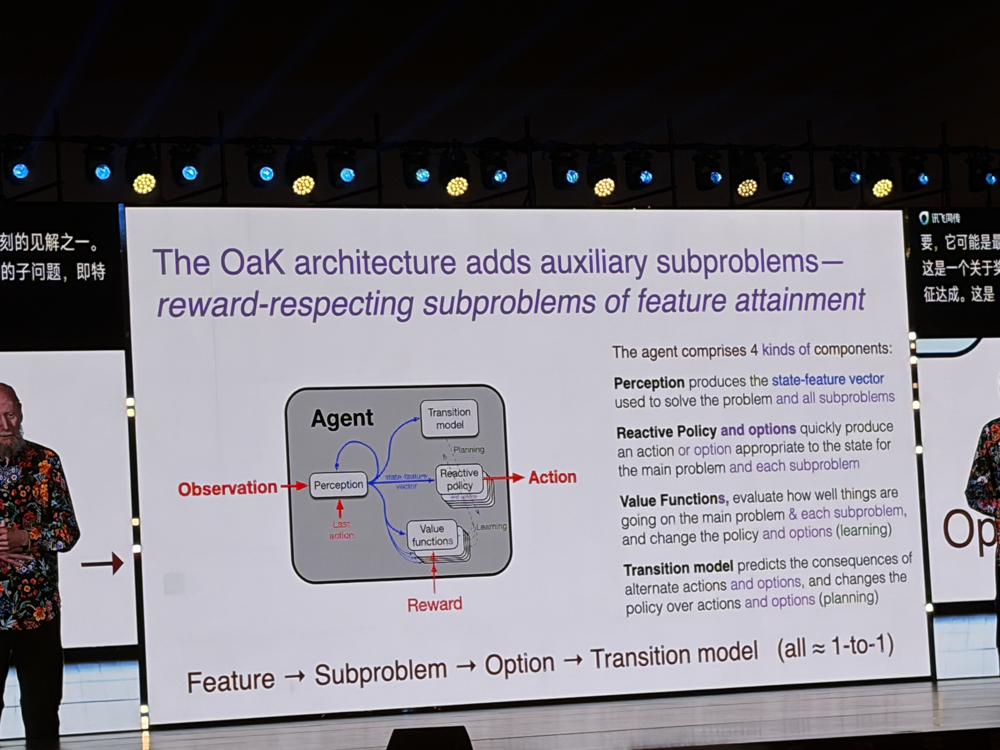
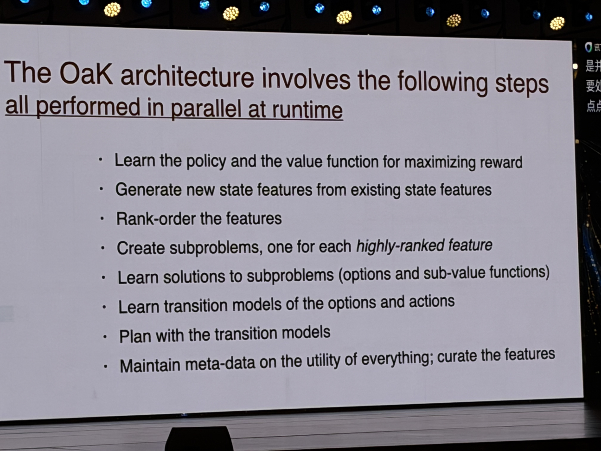
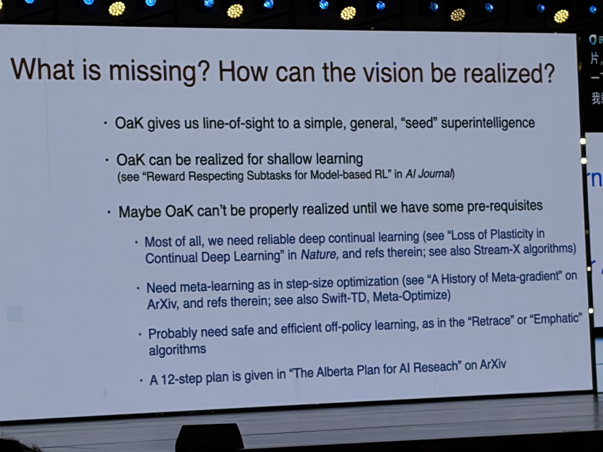

# WAIC 2026: Richard Sutton's OaK Architecture, First Principles, and Lessons for Agents

> Evidence reviewed: a 71-minute recording of the talk, a Doubao-generated conference PDF, 15 on-site photographs, and Sutton's papers and public talks.
> Analysis date: 2026-07-20. For disputed claims, the evidence order is: original recording and on-site photographs > official papers and talks > media reports > automated summaries.

[中文版](./waic-2026-oak-analysis.md)

## Executive Summary

This talk was not about scaling LLMs, improving Transformers, or refining pretraining recipes. It presented a reinforcement-learning-based path toward general intelligence: an agent should continually learn from first-person runtime experience and develop state features, subproblems, reusable skills, consequence models, and planning capabilities across multiple time scales.

The name OaK—Options and Knowledge—and its complete composition are relatively new, but most of its ingredients are not. MDPs, value functions, model-based reinforcement learning, options, and General Value Functions (GVFs) all have long research histories. OaK's main novelty is organizing these components into an open-ended, continuously operating cognitive architecture and emphasizing that the agent should discover useful abstractions for itself.

Claude Code, Cursor, and similar coding agents have functional analogies to OaK in task decomposition, tools, skills, subagents, memory, and feedback loops. However, there is no public evidence that they were designed according to OaK. Current coding agents generally use a frozen pretrained LLM that adapts through context and external storage. OaK instead requires runtime experience to continually change policies, representations, values, and world models.

## 1. What Are the "First Principles of AI" in This Talk?

Sutton did not present one unique, closed, universally accepted axiom of AI. In the recording, he used plural and exploratory expressions such as `simple/basic principles` and `my quest for those principles`. The most accurate interpretation is a chain connecting a problem definition, methodological principles, and architectural consequences.

### 1.1 Problem Definition: Continual Interaction

An agent interacts with the world through `observation → action → reward`. Reward is the scalar feedback that defines the objective, the policy selects actions, and the value function estimates future cumulative reward.

### 1.2 World Assumption: The Big World

The real world is much larger than any finite agent. Policies, value functions, and world models can only be approximations. Even when the world is globally stable, an agent's local environment may appear non-stationary. The agent therefore cannot learn only once at design time; it must continue adapting at runtime.

### 1.3 Methodological Principle: The Bitter Lesson

Long-term, scalable breakthroughs tend to come from search and learning methods that can exploit increasing computation, rather than from encoding large amounts of human domain knowledge into the system. The Bitter Lesson is guidance about where research effort should go; it is not a complete theory of intelligence.

### 1.4 Runtime Consequence

Learning, planning, and abstraction formation must be able to happen at runtime. They may also happen at design time, but they cannot happen only at design time. Doubao's statement that "all capabilities must be formed exclusively after deployment" is too strong.

### 1.5 Development Goal

The architecture should be:

- **domain-general**: not dependent on manually encoded rules for a particular domain;
- **experiential**: ultimately grounded in the agent's own interaction experience;
- **open-ended**: continually able to create new state and temporal abstractions;
- **scalable**: able to benefit from increasing computation through search and learning.

## 2. What Is OaK?

OaK can be summarized as the following loop:

1. Form or discover useful **state features** from experience.
2. Create a **reward-respecting subproblem** for a valuable, context-dependent feature.
3. Learn an **option**—a policy plus its termination condition—for the subproblem.
4. Learn the option's **transition model**, including its terminal-state outcome and cumulative reward.
5. Plan using both action models and option models.
6. Use planning utility and real execution outcomes to retain, merge, or remove features, subproblems, options, and models.

Here, `model` does not mean a neural network in the general sense. It means a transition model in reinforcement learning: a predictor of the state reached after an action or option and the cumulative reward received along the way.

### 2.1 The Established Components

- MDPs, policies, value functions, and value iteration;
- model-based reinforcement learning;
- the Options framework, dating to 1999, which expresses temporal abstraction as a policy plus a termination condition;
- GVFs and Horde, which represent knowledge as policy-contingent predictions testable through experience;
- continual learning, off-policy learning, and planning.

### 2.2 The Newer Composition

- Organizing `feature → reward-respecting subproblem → option → option model` into a generative chain;
- allowing the agent to use the primary value function to select subproblems worth mastering;
- continually curating capabilities through utility metadata instead of accumulating them indefinitely;
- using options as larger planning steps that can, in turn, support still higher-level abstractions.

The most accurate historical characterization is that options and the other components have existed for decades; the Alberta Plan and STOMP direction were documented in 2022; the 2023 work on reward-respecting subtasks explicitly developed the mechanism and referred to an extended FC-STOMP/Oak direction; and Sutton presented the complete OaK architecture publicly in a consolidated form in 2025.

### 2.3 What OaK Has Not Yet Solved

OaK is a research program, not a mature Agent framework that can be installed today. Major prerequisites remain unresolved:

- reliable continual learning in deep networks without catastrophic forgetting or loss of plasticity;
- automatic discovery of genuinely useful state features;
- large-scale, stable, safe, and efficient off-policy learning;
- selection of the few features worth turning into subproblems, options, and models;
- reliable alignment of scalar reward with complex real-world objectives, safety boundaries, and plural human values.

## 3. Relationship to Current LLM Agents

ReAct, Plan-and-Execute, LangGraph, Claude Code, and Cursor all implement some form of an observe–reason–act–observe loop. OaK goes further: the loop is expected to change the agent itself over time. Most current coding agents instead maintain context and external state around a frozen model.

The main differences are:

- **Policy**: OaK continually learns policies from runtime experience. A coding agent mainly asks a pretrained LLM to generate the next action in context.
- **Value function**: OaK explicitly learns values for the primary problem and its subproblems. Coding agents can use tests, linting, self-critique, and verifier feedback, but they generally do not expose an explicit learned RL value function.
- **Option**: An OaK option is a learned policy with a termination condition. A skill, tool workflow, or subagent is a useful engineering analogy, but it is usually designed by a human or planned temporarily by an LLM.
- **Transition model**: OaK learns the terminal-state distribution and cumulative reward of actions and options. Coding agents usually execute a tool and observe the real result; they do not expose an online learned option model.
- **Planning**: Both plan, but OaK plans with a learned world model, whereas LLM agents primarily reason in token/context space and call tools.
- **Runtime learning**: OaK continually updates weights, representations, skills, and models. Coding agents usually update context, rules, files, or external memory while leaving the base model weights unchanged.
- **Subproblem discovery**: OaK derives reward-respecting subproblems from valuable features. Coding agents generally decompose tasks from the prompt.

Functional similarity therefore does not establish that Claude Code or Cursor implements OaK.

A pretrained LLM could serve as perception, a feature generator, or a policy prior in a hybrid OaK system. That would be an engineering hybrid rather than Sutton's purest position, which emphasizes capabilities growing from the agent's own first-person runtime experience.

## 4. The Most Useful Lessons for Production Agents

The following principles can be applied now:

1. **Reward-respecting subtasks**: a subagent must inherit the primary objective, hard constraints, permissions, and cost boundaries instead of optimizing only a local KPI.
2. **Option-like skills**: every skill should define applicability, inputs, steps, success criteria, failure outcomes, and termination conditions.
3. **Multi-timescale planning**: use reusable high-level skills for long-range plans, but observe again at every option boundary and allow early termination and replanning.
4. **Experience models**: track the success rate, latency, cost, risk, and side effects of tools and skills under different state conditions.
5. **Utility-driven curation**: retain, merge, or remove memories, skills, and subagents based on their demonstrated contribution to final task outcomes.
6. **Separate hard constraints from reward**: permissions, safety, and irreversible actions must not be soft scores that can be offset by other gains.

The idea that "the agent should create its own goals" should not be copied directly into production. People must define top-level objectives, permissions, and inviolable constraints; the agent may propose subproblems only within those boundaries. Otherwise, open-ended goal generation amplifies reward hacking, privilege expansion, and unpredictable behavior.

## 5. Key Corrections to the Doubao Notes

### Clear Errors

- **"2024 World AI Conference"**: the event was WAIC 2026. The year 2024 refers to Sutton's Turing Award.
- **"Aligned with the OpenAI AGI roadmap"**: the audience question was about Yann LeCun's JEPA direction. Sutton said the two approaches had similar elements—including policy, perception, value functions, and transition models—and noted that one disagreement was LeCun's dislike of the term reinforcement learning.
- **"middle lesson / metal learning / Subhop"**: these were transcription errors for Bitter Lesson, meta-learning, and subproblem.

### Correct or Substantially Correct

- **25% by 2030 and 50% by 2040**: the recording clearly says `one chance in four by 2030` and `one chance in two by 2040`. Some media reports gave 10%, but that does not match the on-site recording.

### Overstated or Overinterpreted

- **"All capabilities are formed exclusively after deployment"**: the original point was that learning, planning, and abstraction must be possible at runtime, while they may also occur at design time.
- **"A permanent capability library"**: OaK explicitly maintains utility metadata and performs curation; low-value features and options should be removed.
- **"Intrinsic reward eliminates reward gaming"**: the Q&A supports reducing dependence on subjective human scoring and letting the agent receive reward it can perceive from the world. It does not establish that reward gaming is eliminated.
- **"Experiential learning cannot find an optimal TSP solution"**: the reasonable interpretation is that OaK is not a general replacement for exact combinatorial optimization, not that it is mathematically impossible for it ever to produce an optimal solution.

## 6. Questions Worth Pursuing

### How Does OaK Avoid Creating Unlimited Useless Subgoals?

Sutton acknowledged that there is no complete answer yet. The talk suggested prioritizing features that are strongly related to the primary value function but whose weights vary with state, then propagating actual planning utility back to those objects and removing low-value ones.

### Is Scalar Reward Sufficient for Complex Values?

This is the reward hypothesis, not a proven theorem. Conflicting stakeholder values, safety constraints, delayed feedback, and reward hacking remain weak points. Engineering systems should keep hard constraints separate from optimization objectives.

### Why Is OaK in Tension with the Mainstream LLM Direction?

LLMs absorb large amounts of human knowledge during design-time pretraining and are usually frozen after deployment. OaK requires core knowledge, representations, and skills to continue forming from first-person runtime experience. A hybrid can be practical, but it departs from the purest research hypothesis.

## 7. Recommended Learning Sequence

1. Sutton and Barto, *Reinforcement Learning*: MDPs, values, policies, and planning.
2. The Options framework: temporal abstraction as policy plus termination.
3. GVFs and Horde: knowledge as testable, policy-contingent prediction.
4. Reward-respecting Subtasks: the most concrete and testable OaK mechanism in this talk.
5. The Alberta Plan and the public OaK talks: the complete research direction and its unsolved prerequisites.

## Primary Sources

- Richard Sutton, [The Bitter Lesson](http://www.incompleteideas.net/IncIdeas/BitterLesson.html), 2019.
- Sutton et al., [The Alberta Plan for AI Research](https://arxiv.org/abs/2208.11173).
- Sutton et al., [Reward-respecting Subtasks](https://arxiv.org/abs/2202.03466).
- Amii, [OaK Architecture — Rich Sutton, RLC 2025](https://www.amii.ca/videos/oak-architecture-rich-sutton-rlc2025).
- [Full RLC 2025 OaK talk](https://www.youtube.com/watch?v=gEbbGyNkR2U).
- [Cursor Agent documentation](https://cursor.com/docs/agent/overview).
- [Claude Code subagents documentation](https://docs.anthropic.com/en/docs/claude-code/sub-agents).
- Local primary materials: the original recording, Doubao PDF, and 15 on-site photographs under `docs/assets/waic-oak/`.

The interactive Chinese analysis is preserved in [`waic-2026-oak-analysis.canvas.tsx`](./waic-2026-oak-analysis.canvas.tsx). The English archive PDF is [`waic-2026-oak-analysis.en.pdf`](./waic-2026-oak-analysis.en.pdf).
